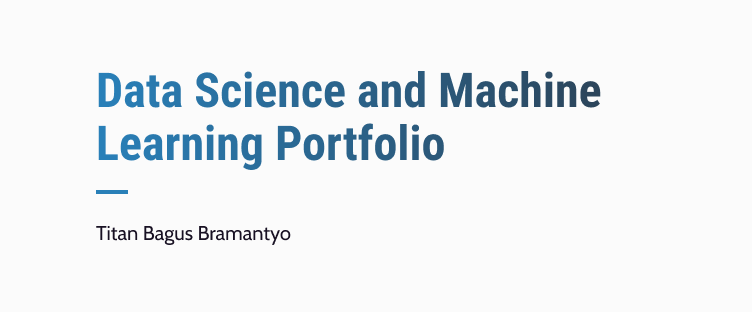

  

---

Repositori pribadi untuk mendokumentasikan hasil belajar mengenai data science beserta dokumen analisisnya. Bahasa yang digunakan dalam proses analisis adalah Python. Biasa menggunakan text editor VSCode (lebih sering) dan Jupyter Notebook.

 

Apabila setelah Anda mengkaji hasil analisis pada repositori ini dan menemukan kekeliruan atau saran perbaikan, penulis sangat terbuka menerima hal-hal tersebut. Silahkan untuk menghubungi via email di **titan.bramantyo@students.amikom.ac.id**.

<!-- Sesi Data Analytic -->

Daftar Project Data Analisis

  
  - [[📂](https://github.com/katibpasha/data_science_portfolio/tree/main/Project/Data-Analisis/Analisis-kecelakaan-lalin-prancis)] Analisis Kecelakaan Lalu Lintas di Prancis

<!-- Sesi Machine Learning -->

Daftar Project Machine Learning

  
  - [[📂](https://github.com/katibpasha/data_science_portfolio/tree/main/Project/Machine-Learning/Deteksi-hepatitis-c)] Deteksi Penyakit Hepatitis C
  - [[📂](https://github.com/katibpasha/data_science_portfolio/tree/main/Project/Machine-Learning/Rekognisi-corak-batik)] Rekognisi Corak Batik Parang & Ceplok

