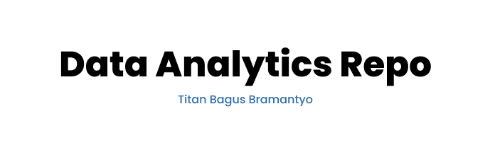

  

Repositori pribadi dari Titan Bagus Bramantyo untuk mendokumentasikan hasil belajar mengenai data science beserta dokumen analisisnya. Bahasa yang digunakan dalam proses analisis adalah Python. Biasa menggunakan text editor VSCode (lebih sering) dan Jupyter Notebook.

Apabila setelah Anda mengkaji hasil analisis pada repositori ini dan menemukan kekeliruan atau saran perbaikan, penulis sangat terbuka menerima hal-hal tersebut. Silahkan untuk menghubungi via email di titan.bramantyo@students.amikom.ac.id.

